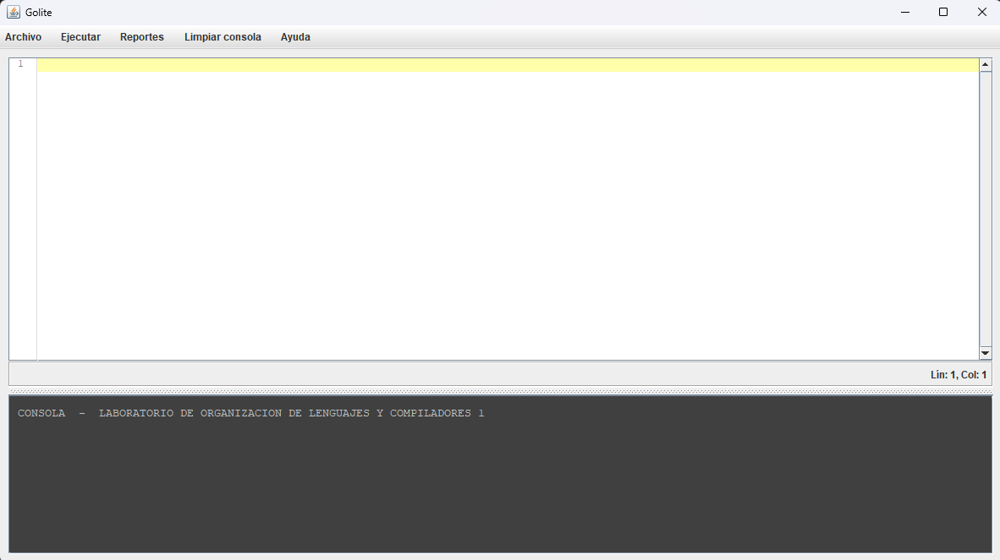

# Manual de Usuario de GoLite

## 1. Introducción

GoLite es un editor e intérprete de un lenguaje tipo Go desarrollado para el curso de Organización de Lenguajes y Compiladores 1. Permite escribir código, ejecutar la aplicación, ver el resultado en consola y generar reportes de errores y de símbolos.

## 2. Requisitos

- Java JDK 24 o superior instalado.
- Maven instalado.
- El proyecto debe estar descargado en una carpeta local con los archivos fuente y `pom.xml` presentes.

## 3. Cómo iniciar el programa

### 3.1 Desde la terminal con Maven

1. Abre una terminal en la carpeta del proyecto:
   `tucarpeta\golite`
2. Compila y ejecuta el proyecto con Maven:
   `mvn clean compile exec:java -Dexec.mainClass=com.olc1.App`

### 3.2 Desde un IDE

1. Abre el proyecto en tu IDE favorito (IntelliJ IDEA, Eclipse, NetBeans, VS Code con soporte Java).
2. Ejecuta la clase principal `com.olc1.App`.

## 4. Interfaz principal

La aplicación abre una ventana con el editor de código en la parte superior y la consola en la parte inferior. También muestra una barra de menú con las opciones principales del programa.



## 5. Componentes principales

### 5.1 Editor de código

- El editor permite escribir código con resaltado de sintaxis para un lenguaje similar a Go.
- Tiene indentación automática y un panel que muestra la línea y columna actuales.
- Puede contener declaraciones, expresiones, llamadas a `fmt.Println`, estructuras condicionales y bucles compatibles con el intérprete.

### 5.2 Consola

- La consola muestra mensajes de ejecución, salidas del programa y mensajes de error.
- Está bloqueada para edición manual; el usuario sólo ve los resultados.
- El botón `Limpiar consola` restaura el contenido inicial.

### 5.3 Barra de menú

- `Archivo > Nuevo`: carga un ejemplo de código por defecto.
- `Archivo > Salir`: cierra la aplicación.
- `Ejecutar`: procesa el código actual y muestra el resultado en la consola.
- `Limpiar consola`: limpia la salida y muestra el encabezado inicial.
- `Reportes > Reporte de tokens`: muestra la tabla de símbolos generada tras la última ejecución.
- `Reportes > Reporte de errores`: genera y abre un reporte HTML con errores léxicos, sintácticos y semánticos.
- `Ayuda > Acerca de`: muestra información de la versión.

## 6. Uso completo del programa

### 6.1 Escribir o cargar código

- Escribe tu programa en el panel del editor.
- Si quieres empezar con un ejemplo rápido, selecciona `Archivo > Nuevo`.
- El ejemplo predeterminado es:

```go
fmt.Println(5+5);
```

### 6.2 Ejecutar el código

- Haz clic en `Ejecutar`.
- La aplicación realiza:
  - Análisis léxico (tokenización).
  - Análisis sintáctico (parsing).
  - Interpretación del árbol de sintaxis abstracta (AST).
- Si la ejecución es exitosa, la salida resultante aparece en la consola.

### 6.3 Ver resultados de salida

- El texto que imprime tu programa se agrega en la consola.
- Si ocurre un error, la consola mostrará una línea como:
  `Error: <mensaje>`

### 6.4 Limpiar la consola

- Presiona `Limpiar consola` para borrar la salida anterior.
- La consola volverá a mostrar el encabezado inicial del laboratorio.

## 7. Reportes y análisis

### 7.1 Reporte de errores

- Debes ejecutar el código primero para que existan datos de análisis.
- Selecciona `Reportes > Reporte de errores`.
- El programa genera un archivo HTML con:
  - Errores léxicos.
  - Errores sintácticos.
  - Errores semánticos.
- Si el navegador está disponible, el reporte se abrirá automáticamente. Si no, la consola mostrará la ubicación del archivo HTML.

### 7.2 Reporte de tokens / Tabla de símbolos

- Selecciona `Reportes > Reporte de tokens` después de ejecutar el código.
- El programa muestra en la consola la tabla de símbolos con cada variable encontrada durante la ejecución.
- Si aún no se ha ejecutado nada, el programa indicará que no hay datos.

## 8. Recomendaciones de uso

- Escribe primero programas pequeños y ejecútalos con frecuencia.
- Si aparece un error, revisa la consola y genera el reporte de errores para ver detalles precisos.
- Usa `Archivo > Nuevo` para recuperar rápidamente un ejemplo funcional.

## 9. Ejemplos de código válidos

Ejemplo 1:

```go
fmt.Println(10 + 20);
```

Ejemplo 2:

```go
var x = 5;
fmt.Println(x + 3);
```

Ejemplo 3:

```go
var x = 4;
if x > 2 {
    fmt.Println("x es mayor que 2");
}
```

## 10. Mensajes importantes

- Si seleccionas `Reporte de errores` sin ejecutar el programa primero, aparecerá un aviso indicando que debes ejecutar el código primero.
- El botón `Salir` cierra la aplicación inmediatamente.
- La interfaz está diseñada para facilitar el ciclo de edición-ejecución-análisis.

---

**Fin del manual de usuario de GoLite**
